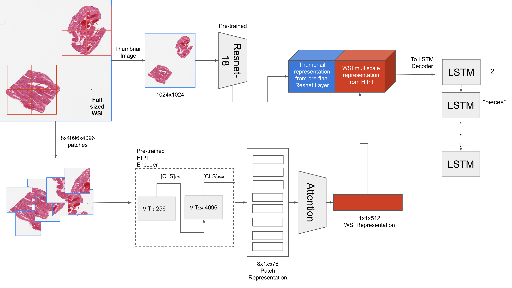

Paper Link: https://arxiv.org/abs/2311.06176

Accepted as Extended Abstract at ML4H 2023: https://ml4h.cc/2023/.

We build upon this work by replacing LSTM based decoders with BioClinicalBERT based decoder [HistoCapBERT](https://github.com/ssen7/histo_cap_transformers).

## Method Overview

Abstract:
Deep learning for histopathology has been successfully used for disease classification, image segmentation and more. However, combining image and text modalities using current state-of-the-art methods has been a challenge due to the high resolution of histopathology images. Automatic report generation for histopathology images is one such challenge. In this work, we show that using an existing pre-trained Vision Transformer in a two-step process of first using it to encode 4096x4096 sized patches of the Whole Slide Image (WSI) and then using it as the encoder and an LSTM decoder for report generation, we can build a fairly performant and portable report generation mechanism that takes into account the whole of the high resolution image, instead of just the patches. We are also able to use representations from an existing powerful pre-trained hierarchical vision transformer and show its usefulness in not just zero shot classification but also for report generation.

To run the lightning scripts, use requirements.txt to install the necessary packages and then run the training scripts. Details on the different script are given bellow.

- data_files/ directory: Contains the necessary vocabulary file (word_map.json) and train/test/val pandas dataframe stored as a pickle file to preserve data types.
- models.py: Contains model definitions
- dataloader.py: Contains the custom PyTorch dataloader.
- patch_4k_h5.py: Contains the code for patching high resolution WSIs in the form SVS images and save the patches in an hdf5 format.
- generate4k_256clsreps.py: Extract the representations from pre-trained ViT. WARNING: To run this script download the following GitHub repo: https://github.com/mahmoodlab/HIPT

### Training scripts:

- Train vanilla resnet model: training_script_only_resnet.py and training_script_only_resnet_random_init.py (self explanatory).
- Train model with only ViT encoder: training_script_only_vit.py
- Train model with ViT encoder + Resnet reps: training_script_only_resnet_plus_vit.py